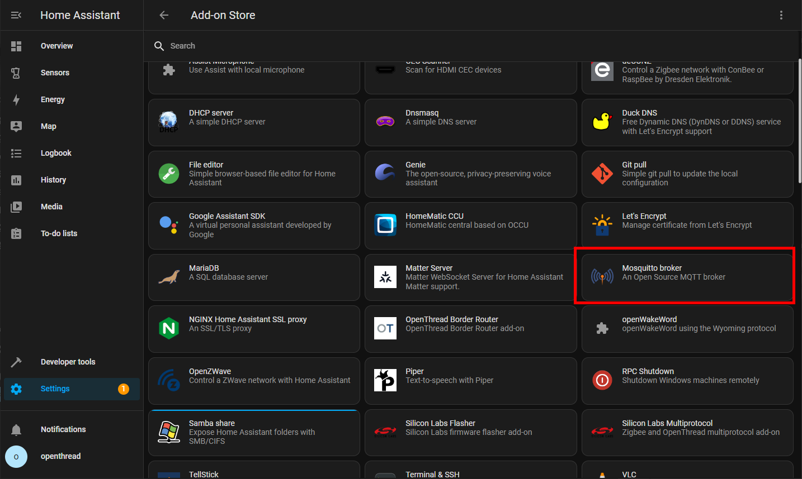
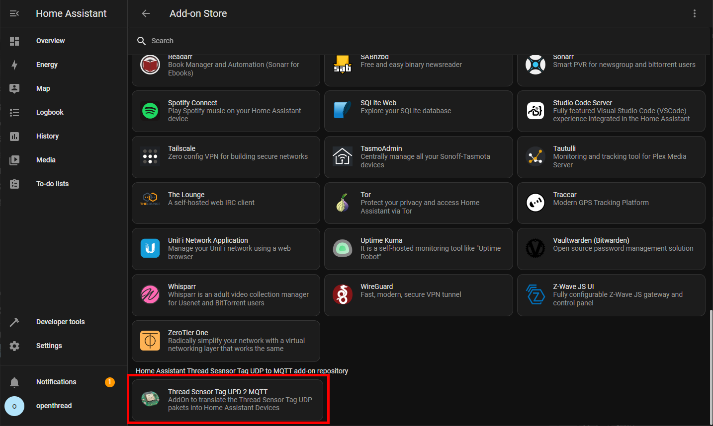
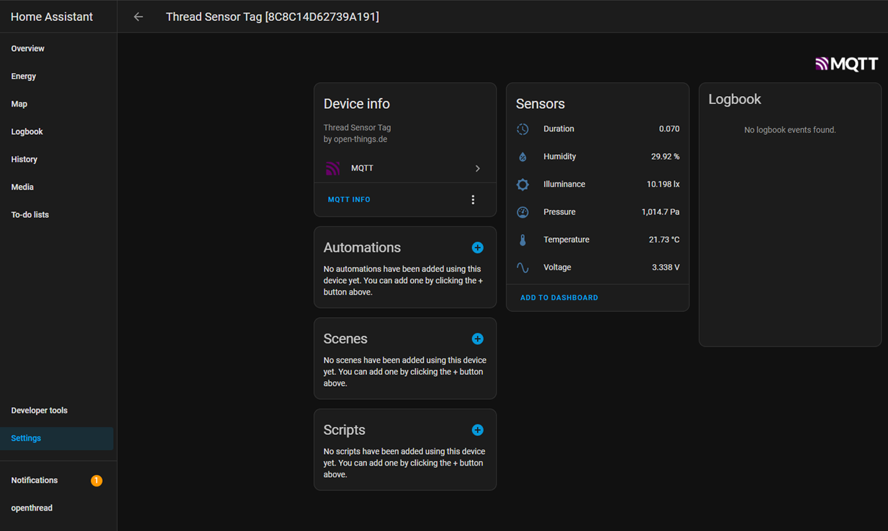

## Home Assistant Add-on: Thread Sensor Tag UDP to MQTT

This document describes how to setup and install all Add-ons to get the Open Soruce [Thread Sensor Tag](https://www.tindie.com/products/23918/) connected to the Thread Network and publish its sensor data for Temperature, Pressure, Humidiy and Light into the system.
You need an Open Thread Border Router setup to connect the Thread Sensor Tag. If you do not have that you can setup a Border Router using the Home Assistant SkyConnect Dongle or a [nRF52840 USB Dongle](https://www.nordicsemi.com/Products/Development-hardware/nrf52840-dongle). 

## Setup Thread Border Router using nRF52840 USB Dongle
To setup a Open Thread Border Router with a nRF52840 USB Dongle you need the RCP Firmware. You can relatively easy flash the nRF52840 Firmware to the USB Dongle by following this steps:

1. **Make sure** you have the **nrfutils installed** on your computer. If not you can follow this [guide](https://www.nordicsemi.com/Products/Development-tools/nrf-util)
2. **Plugin the nRF52840 USB Dongle** and press the reset button. The red LED will fade in and out to show that the device is in the right state.
3. **Download** the [Firmware ZIP](https://file.io/QjCBbPBMMmKu) 
4. **Run** the following command to flash the nRF52840 USB Dongle
 `nrfutil dfu usb-serial -pkg ot-rcp.zip -p /dev/ttyACM0`

Make sure the Path and USB port are corerct. On windows just replace `/dev/ttyACM0` with `COMx`.

If you want to build the latest version of the firmware yourself you can follow the [official nordic guide](https://developer.nordicsemi.com/nRF_Connect_SDK/doc/1.9.99-dev1/matter/openthread_rcp_nrf_dongle.html)

## Setup Home Assistant
You can use the flashed nRF52840 USB Dongle or the SkyConnect from Home Assistant to open a OpenThread Border Router network.

### Setup OpenThread Border Router
1. **Connect** the flashed **nRF52840 Dongle** to the Home Assistant Device
2. Open your Profile Settings on the bottom left sidemenu and scroll down to the setting to **enable the Advanced Mode**
3. Go to **Settings -> Add-ons** and press the **ADD-ON STORE** button on the bottom right
4. Search for and **install OpenThread Border Router AddOn**
5. Open the OpenThread Border Router AddOn and **configure it** as follows. 
6. Select the Device in the Device section
7. Set the Baudrate to **115200**
8. **Uncheck/disable** the **OTBR Firwall** option and press save.
9. Enable **Show disabled ports**
10. Enter **8080** as OpenThread Web Port
11. Enter **8081** as OpenThread Rest Api Port
12. Press save to save the setting and go to the info tab
13. Press **start** to boot up the OpenThread Border Router

### Install the MQTT AddOn
To see the Thread Sensor Tag as a device in Home Assistant we also need to enable the MQTT Broker functionality.

1. Go to **"Settings -> Add-Ons"** and press **"ADD-ON STORE"**
2. Search for Mosquitto MQTT Broker and install it
3. In the Info Tab Start the AddOn

### Install the Thread Sensor Tag UDP to MQTT AddOn

1. Navigate to **Settings -> Add-ons** and press **ADD-ON STORE**
2. Click on the three dots on the top right -> **repositories**
4. **Add** `https://github.com/open-thngs/home-assistant-sensor-tag-addon` and press add
5. scroll down until you see the **"Thread Sensor Tag UPD 2 MQTT"** and install it (you might have to refresh the page)
6. Start the AddOn in the Info Tab

## Connect the Thread Sensor Tag

1. Put a battery into the Thread Sensor Tag
2. Go to the WebGUI (http://homeassistant:8080/) of the OpenThread Border Router
3. Go to **Commission** menu entry
4. Type **`ABCDE4`** into the PSKd and press *commission*

Once the Device is successfully commissioned into the Thread Network it will start sending out UDP pakets. The AddOn will read the UDP Pakets and translate them into Devices in Home Assistant. You can find the Thread Sensor Tag now as a Device in your Home Assistant.

Go to **Settings -> Devices & Services** and click on Devices in the Top Tab menu. In the List of devices you should see a Thread Sensor Tag. It might take a few minutes to first see it. You can always check in the Open Thread Border Router WebGUI under **Topology** if there is a client connected to the network.

